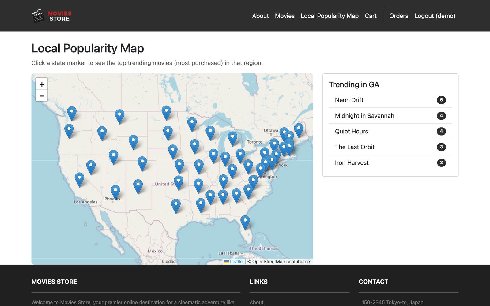
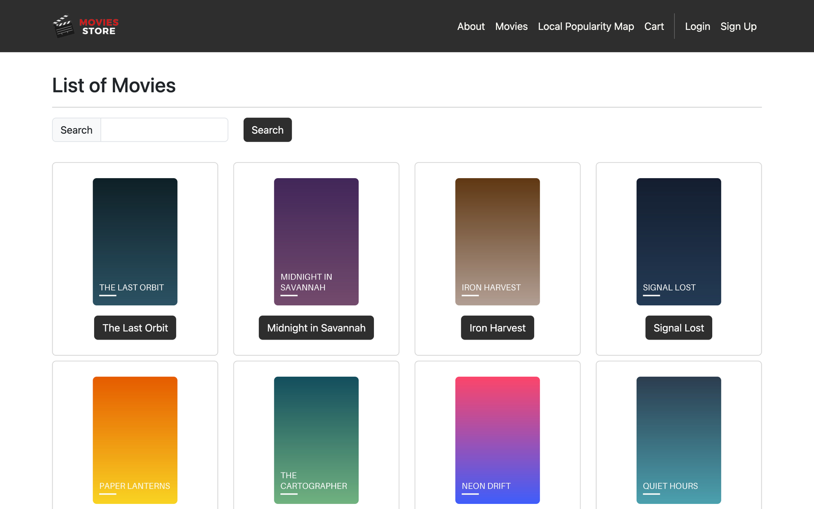
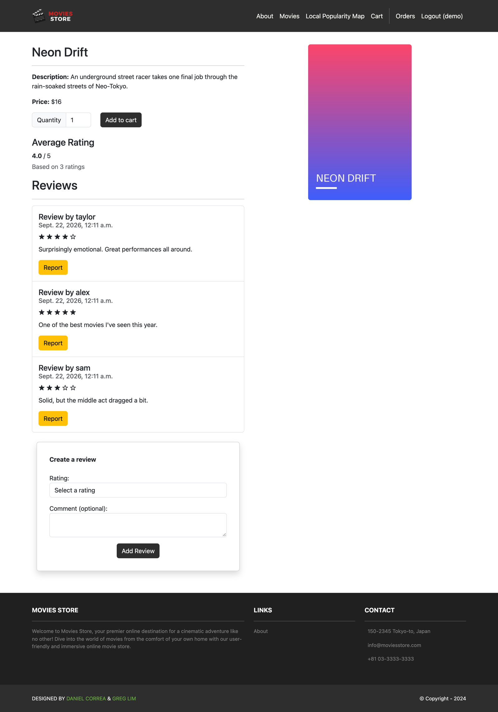
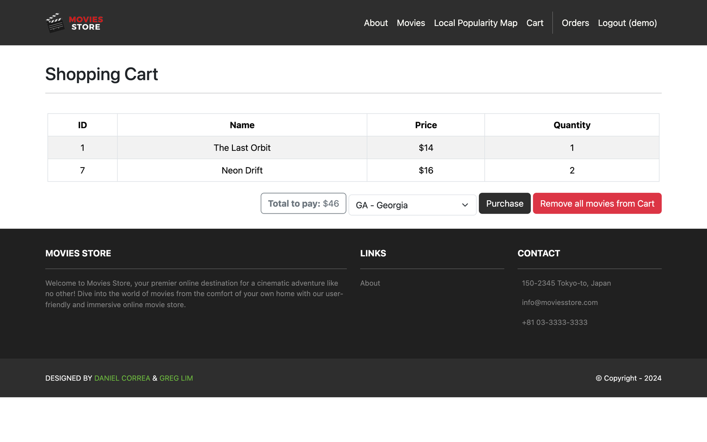
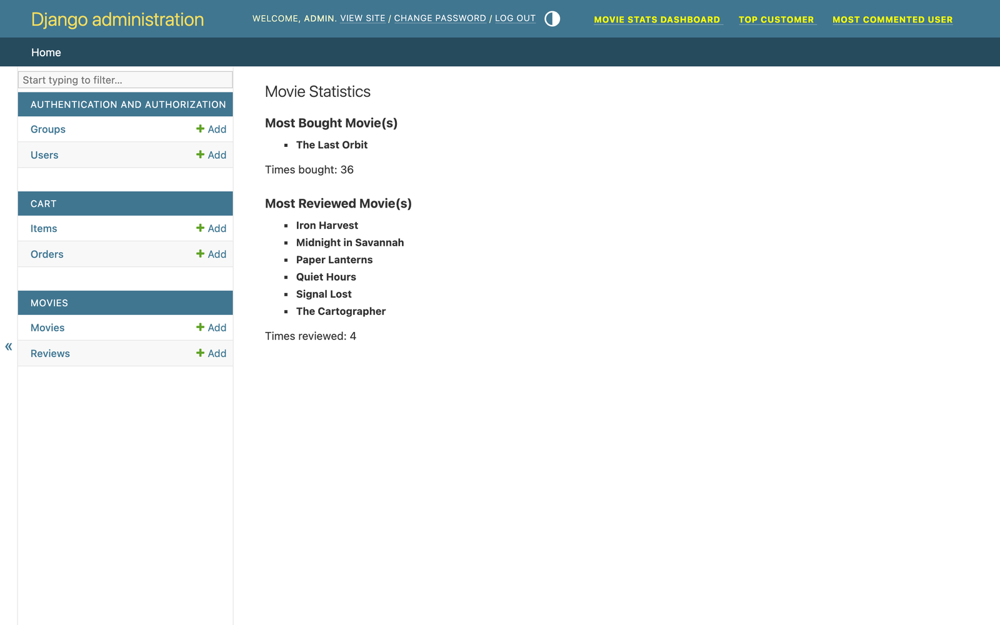

# Movie Store

An online movie store built with Django: browse a catalog, leave star ratings and reviews, check out a cart, and see which movies are trending in each US state on an interactive map.

Team project for **CS 2340 (Objects and Design) at Georgia Tech**, Spring 2026.




## Features

- **Catalog and search:** browse and search movies, each with a detail page, price and poster.
- **Ratings and reviews:** 1–5 star ratings with a live average, plus create, edit, delete and report on reviews (one review per user per movie, enforced by a DB constraint).
- **Cart and checkout:** session-based cart, order history, and a shipping state recorded on every order.
- **Local Popularity Map:** a Leaflet/OpenStreetMap view with a marker for every state. Clicking a state calls a JSON endpoint that aggregates purchases by region and returns the top 5 movies.
- **Admin analytics:** custom Django admin pages for most-bought movie, most-reviewed movie, top customer and most active reviewer (ties handled).

## My contributions

- **Project setup:** created the Django project and the `accounts`, `cart`, `home` and `movies` apps that the team built on (following the course textbook's base design).
- **Local Popularity Map (user story 1), end to end:**
  - added a `state` field to `Order` with a migration, and a state picker at checkout
  - built the `local-popularity/data` JSON endpoint, which aggregates `Item` quantities per state with Django ORM `Sum` / `annotate`
  - built the interactive Leaflet map page that loads trending movies asynchronously when a state is clicked
## Screenshots

| Catalog | Movie detail and reviews |
|---|---|
|  |  |
| **Cart with shipping state** | **Admin analytics** |
|  |  |

## Architecture

```
moviesstore/   project settings, root URLs, base template, static assets
home/          landing and about pages
movies/        Movie and Review models, catalog, reviews, popularity map and JSON API, admin analytics
cart/          session cart, Order and Item models, checkout
accounts/      sign up, login and logout, order history
```

Server-rendered Django templates with Bootstrap. The popularity map is the one interactive page: it uses vanilla JS `fetch` against a JSON endpoint, and Leaflet draws the map.

## Run it locally

```bash
git clone https://github.com/fenais/movie-store.git
cd movie-store
python -m venv .venv && source .venv/bin/activate   # Windows: .venv\Scripts\activate
pip install -r requirements.txt
python manage.py migrate
python manage.py seed_demo      # sample movies, reviews and orders
python manage.py runserver
```

Open http://127.0.0.1:8000 and log in as `demo` / `demo12345`. Admin analytics are at `/admin/` with `admin` / `admin12345`.

## Team

Built with [@Ahelwa6](https://github.com/Ahelwa6), [@nahua3730](https://github.com/nahua3730), [@natalieseng](https://github.com/natalieseng) and [@Janaalzahid](https://github.com/Janaalzahid). The full commit history is preserved in this repo.

The base storefront follows the Movies Store project from *Django 5 for the Impatient* by Daniel Correa and Greg Lim, which the course uses. The popularity map, analytics dashboards, state-aware orders and review improvements were built by our team.
